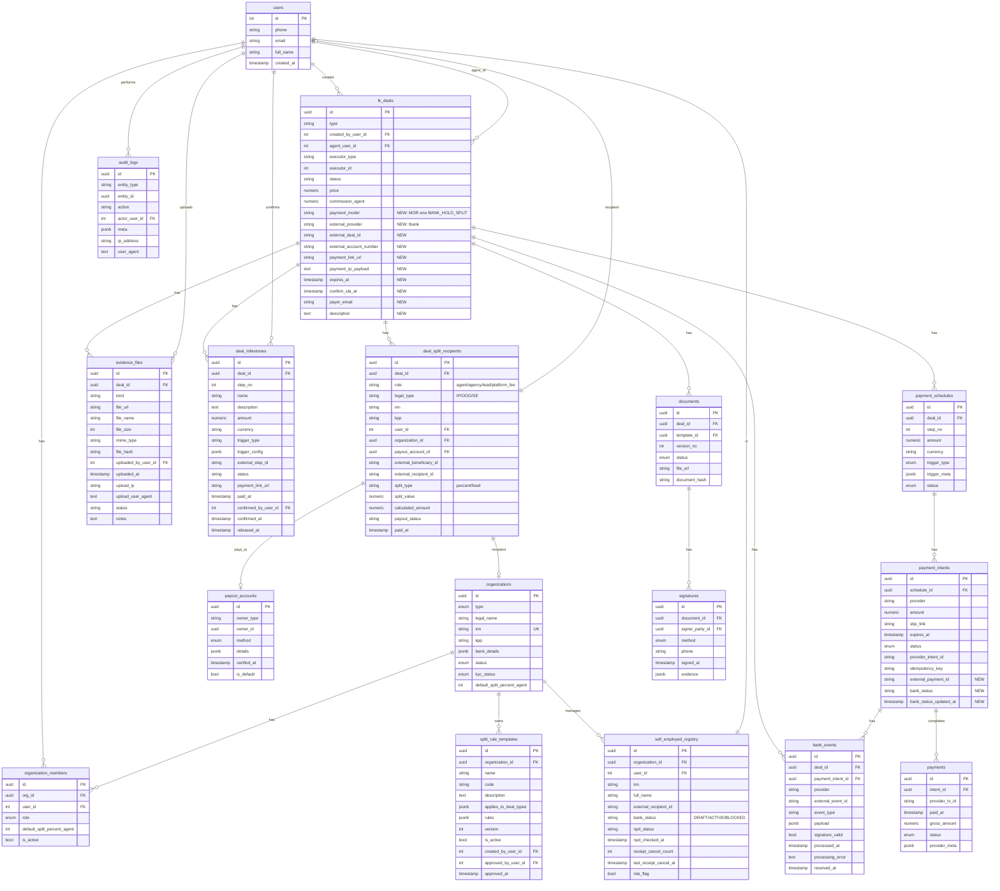

# Схема БД: Bank Hold + Split

## ERD диаграмма (Mermaid)



---

## Текстовая схема связей

```
┌─────────────────────────────────────────────────────────────────────────────┐
│                              CORE ENTITIES                                   │
├─────────────────────────────────────────────────────────────────────────────┤
│                                                                             │
│  ┌──────────┐         ┌───────────────┐         ┌──────────────────┐       │
│  │  users   │────────>│ org_members   │<────────│  organizations   │       │
│  └──────────┘         └───────────────┘         └──────────────────┘       │
│       │                                                  │                  │
│       │                                                  │                  │
│       v                                                  v                  │
│  ┌──────────┐                                   ┌──────────────────┐       │
│  │ lk_deals │<──────────────────────────────────│ split_rule_      │       │
│  │          │                                   │ templates        │       │
│  └──────────┘                                   └──────────────────┘       │
│       │                                                  │                  │
│       │                                                  │                  │
│       ├─────────────────────────┬────────────────────────┤                  │
│       │                         │                        │                  │
│       v                         v                        v                  │
│  ┌──────────────┐    ┌──────────────────┐    ┌──────────────────┐         │
│  │ deal_split_  │    │ deal_milestones  │    │ self_employed_   │         │
│  │ recipients   │    │ (этапы оплаты)   │    │ registry         │         │
│  └──────────────┘    └──────────────────┘    └──────────────────┘         │
│       │                       │                                            │
│       │                       v                                            │
│       │              ┌──────────────────┐                                  │
│       │              │ payment_schedules│                                  │
│       │              └──────────────────┘                                  │
│       │                       │                                            │
│       │                       v                                            │
│       │              ┌──────────────────┐                                  │
│       │              │ payment_intents  │                                  │
│       │              └──────────────────┘                                  │
│       │                       │                                            │
│       │                       ├────────────────────────┐                   │
│       │                       │                        │                   │
│       │                       v                        v                   │
│       │              ┌──────────────────┐    ┌──────────────────┐         │
│       └─────────────>│    payments      │    │   bank_events    │         │
│                      └──────────────────┘    │   (immutable)    │         │
│                                              └──────────────────┘         │
│                                                                             │
├─────────────────────────────────────────────────────────────────────────────┤
│                            DOCUMENTS & AUDIT                                 │
├─────────────────────────────────────────────────────────────────────────────┤
│                                                                             │
│  ┌──────────┐         ┌───────────────┐         ┌──────────────────┐       │
│  │ lk_deals │────────>│   documents   │────────>│   signatures     │       │
│  └──────────┘         └───────────────┘         └──────────────────┘       │
│       │                                                                     │
│       │                                                                     │
│       ├─────────────────────────┬───────────────────────────────────────┐  │
│       │                         │                                        │  │
│       v                         v                                        v  │
│  ┌──────────────┐    ┌──────────────────┐                    ┌──────────┐  │
│  │ evidence_    │    │   audit_logs     │                    │ receipts │  │
│  │ files        │    │   (all actions)  │                    │          │  │
│  └──────────────┘    └──────────────────┘                    └──────────┘  │
│                                                                             │
└─────────────────────────────────────────────────────────────────────────────┘
```

---

## Индексы (критичные для производительности)

```sql
-- Поиск сделок
CREATE INDEX idx_lk_deals_status ON lk_deals(status);
CREATE INDEX idx_lk_deals_payment_model ON lk_deals(payment_model);
CREATE INDEX idx_lk_deals_external_deal_id ON lk_deals(external_deal_id);
CREATE INDEX idx_lk_deals_created_at ON lk_deals(created_at DESC);

-- Участники сплита
CREATE INDEX idx_split_recipients_deal ON deal_split_recipients(deal_id);
CREATE INDEX idx_split_recipients_payout_status ON deal_split_recipients(payout_status);

-- События банка
CREATE INDEX idx_bank_events_deal ON bank_events(deal_id);
CREATE INDEX idx_bank_events_type ON bank_events(event_type);
CREATE INDEX idx_bank_events_received ON bank_events(received_at DESC);

-- Самозанятые
CREATE INDEX idx_se_registry_status ON self_employed_registry(bank_status);
CREATE INDEX idx_se_registry_risk ON self_employed_registry(risk_flag) WHERE risk_flag = true;

-- Milestones
CREATE INDEX idx_milestones_deal_status ON deal_milestones(deal_id, status);
```

---

## Constraints (целостность данных)

```sql
-- Split recipients: сумма процентов = 100
-- (проверяется в коде, не в БД из-за сложности)

-- Milestones: step_no уникален в рамках сделки
ALTER TABLE deal_milestones
ADD CONSTRAINT uq_milestone_step UNIQUE (deal_id, step_no);

-- Self-employed: один пользователь - одна запись в org
ALTER TABLE self_employed_registry
ADD CONSTRAINT uq_se_org_user UNIQUE (organization_id, user_id);

-- Split rule templates: один активный код на org
CREATE UNIQUE INDEX idx_split_rules_active
ON split_rule_templates(organization_id, code)
WHERE is_active = true;
```

---

## Партиционирование (для scale)

```sql
-- bank_events растет быстро, партиционируем по месяцу
CREATE TABLE bank_events (
    ...
) PARTITION BY RANGE (received_at);

CREATE TABLE bank_events_2026_01 PARTITION OF bank_events
    FOR VALUES FROM ('2026-01-01') TO ('2026-02-01');

CREATE TABLE bank_events_2026_02 PARTITION OF bank_events
    FOR VALUES FROM ('2026-02-01') TO ('2026-03-01');
-- и т.д.

-- audit_logs аналогично
```

---

## Примеры данных

### Split Rule Template

```json
{
  "id": "550e8400-e29b-41d4-a716-446655440001",
  "organization_id": "550e8400-e29b-41d4-a716-446655440000",
  "name": "Стандартный сплит 60/35/5",
  "code": "standard_60_35_5",
  "rules": {
    "recipients": [
      {"role": "agent", "type": "percent", "value": 60},
      {"role": "agency", "type": "percent", "value": 35},
      {"role": "platform_fee", "type": "percent", "value": 5}
    ],
    "min_platform_fee": 500,
    "rounding": "floor"
  },
  "version": 1,
  "is_active": true
}
```

### Deal Split Recipients (после оплаты 100,000 руб)

```json
[
  {
    "deal_id": "...",
    "role": "agent",
    "legal_type": "SE",
    "inn": "123456789012",
    "split_type": "percent",
    "split_value": 60,
    "calculated_amount": 60000.00,
    "payout_status": "released"
  },
  {
    "deal_id": "...",
    "role": "agency",
    "legal_type": "OOO",
    "inn": "1234567890",
    "split_type": "percent",
    "split_value": 35,
    "calculated_amount": 35000.00,
    "payout_status": "released"
  },
  {
    "deal_id": "...",
    "role": "platform_fee",
    "legal_type": "OOO",
    "inn": "9876543210",
    "split_type": "percent",
    "split_value": 5,
    "calculated_amount": 5000.00,
    "payout_status": "released"
  }
]
```

### Bank Event

```json
{
  "id": "...",
  "deal_id": "...",
  "provider": "tbank",
  "external_event_id": "evt_abc123",
  "event_type": "payment.completed",
  "payload": {
    "dealId": "tbank_deal_123",
    "amount": 100000,
    "currency": "RUB",
    "payerPhone": "+79001234567",
    "completedAt": "2026-01-16T14:30:00Z"
  },
  "signature_valid": true,
  "processed_at": "2026-01-16T14:30:01Z",
  "received_at": "2026-01-16T14:30:00Z"
}
```

---

*Документ создан: 2026-01-16*
